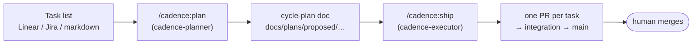
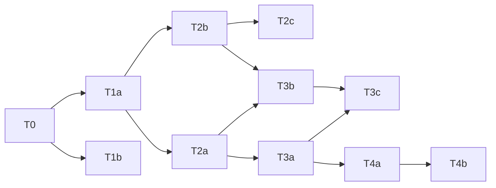
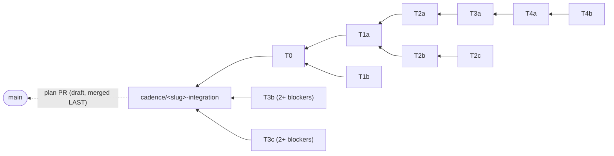
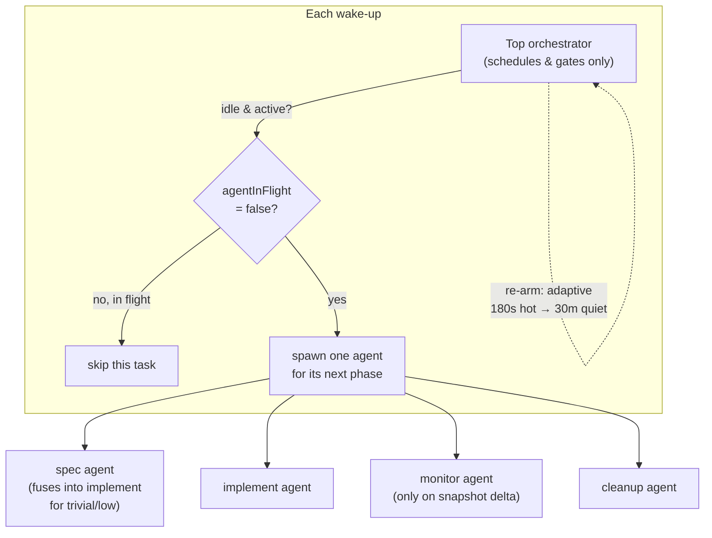
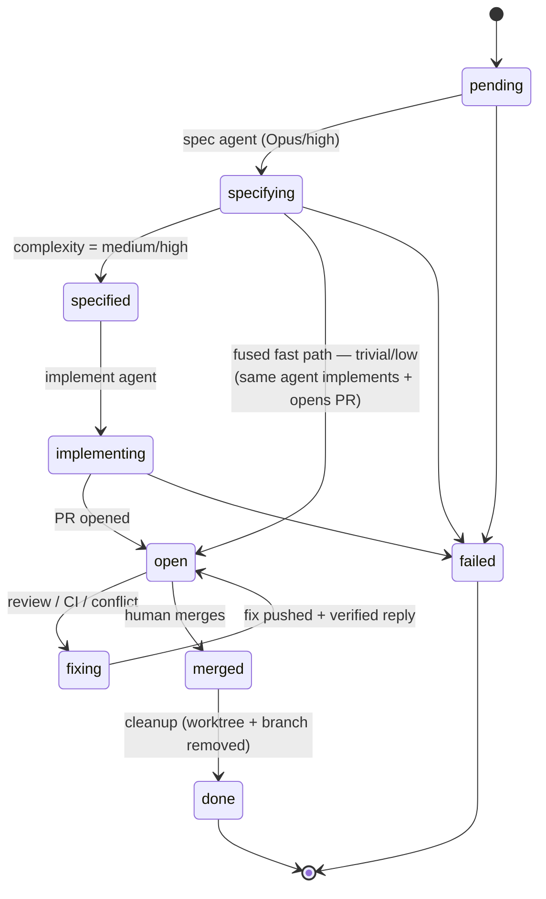
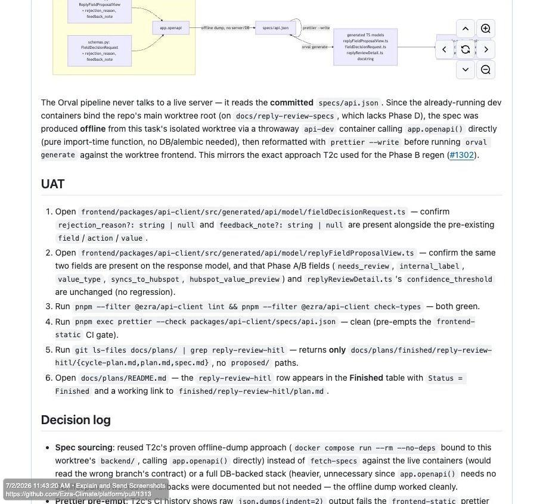
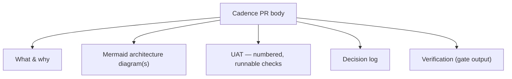

# Cadence

**A plan → ship pipeline for dependency-aware, parallel development cycles.**

Cadence takes a pile of tasks, works out which ones can safely run at the same time,
and drives each one to a merged pull request — one dedicated agent, one branch, one PR
per task — while a human keeps the merge button. It never pushes to `main` and never
merges on its own.

| | |
|---|---|
| **Plugin** | `cadence` (in the `hsb` marketplace) |
| **Install** | `/plugin install cadence@hsb` |
| **Commands** | `/cadence:plan` (schedule), `/cadence:ship` (execute) |
| **Skills** | `cadence-planner`, `cadence-executor` |
| **Requires** | Claude Code · `gh` CLI (authed) · **the `superpowers` plugin (hard requirement)** |
| **Optional** | [`graphifyy`](https://github.com/Graphify-Labs/graphify) — local code knowledge graph that makes analysis cheaper and dependency detection deterministic |

---

## Contents

- [Why Cadence](#why-cadence)
- [Mental model](#mental-model)
- [Requirements](#requirements)
- [Quick start](#quick-start)
- [Core concepts](#core-concepts)
- [Worked example](#worked-example) — a real dependency graph, its waves, and its PRs
- [`/cadence:plan`](#cadenceplan)
- [`/cadence:ship`](#cadenceship)
- [Execution model](#execution-model)
- [Task lifecycle](#task-lifecycle)
- [Anatomy of a Cadence PR](#anatomy-of-a-cadence-pr)
- [Models & complexity](#models--complexity)
- [Reviews: judge before you act](#reviews-judge-before-you-act)
- [State model](#state-model)
- [Safety invariants](#safety-invariants)
- [Tracker integration](#tracker-integration)
- [FAQ](#faq)
- [Glossary](#glossary)

---

## Why Cadence

Batch a handful of tasks onto one branch and you get merge conflicts, a PR nobody can
review, and no idea what depended on what. Run them one at a time and you waste the
parallelism that independent tasks give you for free.

Cadence sits in the middle. It reads the *actual* codebase to learn what each task
touches, derives the real dependency graph from those touch sets (not just from what you
declared), and schedules the work into **waves** of tasks that are safe to run
concurrently. Then it executes every task in its own isolated worktree and opens a
focused PR whose base branch encodes its dependencies — so review stays small and the
history stays legible.

Two skills, one hand-off:

- **`cadence-planner`** decides *what can run in parallel*. Plan-only.
- **`cadence-executor`** *makes it happen*, then babysits every PR until you merge it.

---

## Mental model



The hand-off is a **file**, not memory. The planner writes a cycle-plan doc and records
a `Slug` and `Task-id` in its metadata header; the executor reads those from the
content. You can inspect, edit, or version the plan before a single line of code is
written.

---

## Requirements

Cadence does not work alone. The executor's preflight gate checks these before a
single task is dispatched:

| Dependency | Status | Why | If missing |
|---|---|---|---|
| **`superpowers` plugin** | **Required** | Per-task agents run `superpowers:*` skills end to end — worktrees, brainstorming, writing-plans, TDD, verification, receiving-code-review | The run **stops at preflight** with install instructions. Install it first — a run without it fails midway in confusing ways |
| **`gh` CLI, authenticated** | Required | All PR creation, replies, and thread resolution go through `gh` | The run stops at preflight (`gh auth login`) |
| **Tracker MCP server** (Linear/Jira/…) | Required *only for linked runs* | Status mirroring needs write access | The run stops at preflight for linked plans; unlinked plans don't need it |
| **`graphifyy`** | Optional | Local tree-sitter code knowledge graph — spec/planner analysis queries it (`graphify query/path/explain`) instead of exploring files, at zero LLM cost | Nothing breaks — analysis falls back to reading files. Install: `uv tool install graphifyy` |

---

## Quick start

```
/plugin marketplace add hugo-hsbtech/hsb-plugin-marketplace
/plugin install cadence@hsb
/plugin install superpowers   # required — from the superpowers marketplace
uv tool install graphifyy     # optional — cheaper, deterministic code analysis
```

Plan a cycle from a task list:

```
/cadence:plan
- Add reply-correlation matcher
- Wire matcher into the inbound pipeline (depends on the matcher)
- Add a metrics dashboard
```

Cadence analyzes the repo, writes a wave schedule to
`docs/plans/proposed/<timestamp>-<slug>.md`, and stops. Review it, then ship:

```
/cadence:ship docs/plans/proposed/20260706-1200-<slug>.md
```

From here it runs autonomously — opening branches and PRs, answering review comments,
fixing CI, rebasing on moving bases — and re-arms itself on a scheduled loop until you
have merged everything.

---

## Core concepts

**Touch set** — for each task, the files and surfaces it *creates*, *edits*, *reads*,
and *shares* with other tasks. Computed by fanning out `Explore` subagents over the real
codebase, not guessed from the task title.

**Dependency graph** — edges come from three sources: dependencies you *declared*,
*producer→consumer* links (task B reads a file task A creates), and *write-write
conflicts* (two tasks edit the same surface). When two tasks would collide, Cadence
serializes them rather than gamble.

**Wave** — a topological level of the graph: every task in a wave is independent of the
others in that wave, so the whole wave can run at once. Wave *N* can start once wave
*N-1*'s branches exist.

**Integration branch** — `cadence/<slug>-integration`, cut from `main`. It holds the
plan docs and is the convergence point every task ultimately lands on. It opens as a
**draft plan PR → `main`**, which the human merges **last**.

**Stacked PRs** — a task's PR base encodes its dependency:

- **0 blockers** → base = the integration branch.
- **exactly 1 blocker** → base = that blocker's branch (a *stacked* PR).
- **2+ blockers** → base = the integration branch (the convergence point).

**Flow, don't gate** — a task starts the moment its base *branch exists*, not when its
blocker's PR *merges*. Work never freezes waiting on a human to click merge; dependencies
are expressed by PR base, and rebases carry changes forward as bases advance.

---

## Worked example

Take a cycle of eleven tasks with this dependency graph:



### It levels into waves

Each wave is a set of tasks with no dependency on each other — they run concurrently:

| Wave | Tasks | Runs after |
|---|---|---|
| 1 | `T0` | — |
| 2 | `T1a`, `T1b` | T0 |
| 3 | `T2a`, `T2b` | T1a |
| 4 | `T2c`, `T3a`, `T3b` | T2a / T2b |
| 5 | `T3c`, `T4a` | T3a / T3b |
| 6 | `T4b` | T4a |

**Critical path:** `T0 → T1a → T2a → T3a → T4a → T4b` (six deep) — the shortest possible
wall-clock even with unlimited parallelism.

### Each task's PR base is derived from its blockers

This is *how a PR is created* in Cadence — the base branch is not a choice, it falls out
of the graph:

| Task | Blockers | PR base | Kind |
|---|---|---|---|
| `T0`  | —          | `cadence/<slug>-integration` | root |
| `T1a` | T0         | `T0`'s branch                | stacked |
| `T1b` | T0         | `T0`'s branch                | stacked |
| `T2a` | T1a        | `T1a`'s branch               | stacked |
| `T2b` | T1a        | `T1a`'s branch               | stacked |
| `T2c` | T2b        | `T2b`'s branch               | stacked |
| `T3a` | T2a        | `T2a`'s branch               | stacked |
| `T3b` | T2a, T2b   | `cadence/<slug>-integration` | convergence (2+ blockers) |
| `T3c` | T3a, T3b   | `cadence/<slug>-integration` | convergence (2+ blockers) |
| `T4a` | T3a        | `T3a`'s branch               | stacked |
| `T4b` | T4a        | `T4a`'s branch               | stacked |

### Which produces this branch/PR topology

Every arrow is *"this PR targets that base."* The plan PR is drawn dashed; the human
merges it into `main` last.



The human merges each task PR into integration as it goes green, then merges the single
plan PR into `main` at the end.

---

## `/cadence:plan`

Turn tasks into a wave schedule. **Plan-only** — it never implements or dispatches.

```
/cadence:plan <task list | Linear key | Jira key | path to plan doc>
```

**Input resolution:**

- *Empty* → prompts you for tasks.
- *Linear key* (e.g. `ABC-1234`) → fetches the issue, its sub-issues, and blocker links.
- *Jira key* (e.g. `PROJ-123`) → fetches the issue, sub-tasks, and link relations.
- *File path* → reads that plan doc.
- *Otherwise* → parses free-text / markdown.

**What it does:**

1. Normalizes tasks to stable IDs (`T1`, `T2`, …) with summaries and declared deps.
2. Deep codebase analysis — parallel `Explore` subagents compute each task's touch
   set. With `graphifyy` installed, the graph is refreshed once and subagents query
   it first (`graphify query/path/explain`) — deterministic dependency evidence at
   zero LLM cost, instead of exploratory file reading.
3. Builds the dependency graph (declared + producer→consumer + write-write conflict);
   graphify import/call edges, when present, are the preferred evidence.
4. Levels tasks into waves by topological sort; computes the critical path.
5. Emits the cycle plan to `docs/plans/proposed/<YYYYMMDD-HHMM>-<slug>-<task-id>.md`
   (`<task-id>` = the source tracker key, or `cycle` for free-text), recording
   `Slug` / `Task-id` / timestamp in the metadata header.

Then it stops and presents the schedule. When in doubt about a conflict, it serializes.

---

## `/cadence:ship`

Execute a cycle plan end to end.

```
/cadence:ship <path to a cycle-plan .md>   # empty → uses the plan in context, or run /cadence:plan first
```

It runs as a **thin top orchestrator** that delegates each task to its own agent. It does
not implement, monitor, or fix anything itself — it only schedules, gates, and re-arms.

1. **Preflight gate (blocking).** Verifies the **superpowers plugin is installed**
   (hard stop with install instructions if not), detects optional `graphifyy`,
   then verifies `gh` auth + account, the target repo, and any required MCP servers
   (the tracker's server must have write access if tasks are linked). Fails loud and
   stops if something's missing — nothing dispatches until the gate passes. The gate
   is re-verified only before dispatching *new* build work; pure monitor ticks skip
   the ceremony.
2. **Opens the run.** Creates the integration branch *as a worktree*, sweeps the plan/
   design docs off `main` and commits them there (leaving `main` clean), and opens the
   draft plan PR → `main`.
3. **Ticks.** Each wake-up it first runs **change detection** — one batched read-only
   GraphQL call over all the cycle's PRs, diffed against a stored snapshot — then
   spawns exactly one agent per *idle active* task **that has something to do** and
   re-arms an **adaptive** `ScheduleWakeup` loop. A fully quiet tick costs one API
   call and zero agent spawns. It ends only when the plan PR is merged and every
   task is `done` / `failed`.

---

## Execution model

Two levels, and agents are **re-spawned every tick** rather than kept alive — monitoring a
cycle can span days, and an agent lives only one turn. Continuity lives in the durable
worktree + task file, not in a long-running process.



**Idle-gating** is the core rule: act on a task only when it has no agent mid-flight. A
task whose agent is `specifying` / `implementing` / `fixing` is skipped so you never tick
a PR mid-round-trip. Only a settled `open` PR gets a monitor tick.

**Change detection** keeps quiet monitoring nearly free: each tick starts with one
batched read-only GraphQL call over all the cycle's open PRs (head SHA, `updatedAt`,
review decision, CI rollup, merge state), diffed against a snapshot in `run.json`. A
PR with no delta spawns **no** agent. And the wake-up interval itself **backs off**
— 180s while anything is hot, doubling per quiet tick up to 30 minutes while
everything is parked on humans; any activity snaps it back to 180s. Together these
cut multi-day monitoring cost by an order of magnitude versus fixed-interval,
always-spawn polling.

Each per-task agent owns one durable git worktree and one descriptive branch
(`cadence/<slug>-t<id>-<task-slug>`), and is the **sole writer** of its own task file. It
advances its task exactly one step per tick and does all its own `gh` work.

---

## Task lifecycle



`specifying` / `implementing` / `fixing` are *in-flight* states — the orchestrator skips
them. `specified` and `open` are *settled, idle* states — the next tick acts.

---

## Anatomy of a Cadence PR

Every PR is written **for a human who has not been following the cycle** — didactic,
self-contained, and sized to the task's complexity.

A real high-complexity Cadence PR — note the embedded architecture diagram, the numbered
**UAT** with exact commands, and the **Decision log** capturing each autonomous choice:



A rich task gets the full body:

- **What & why** — plain-language summary of the change and its purpose.
- **Architecture** — one or more **Mermaid diagrams** of the data/flow the change adds.
- **UAT** — a numbered checklist of acceptance tests with the *exact* commands to run
  (lint, type-check, targeted tests, file-existence assertions) and the expected result.
- **Decision log** — every non-trivial autonomous choice as
  `{decision, chosen, alternatives, why, howToRollback}`.
- **Verification** — the gate that was actually run, with output.



**Scaled to complexity:** a `trivial` / `low` one-file change gets a few sentences — no
Mermaid, no full template. Only `high` (and rich `medium`) tasks get the full treatment
above. Siblings are always referenced by **PR number + one-line description**, never a
bare task id. PRs that aren't safe to merge yet (stacked, CI not green, agent in flight)
open as **drafts**.

---

## Models & complexity

The model is chosen by **what the agent is doing**, and each task's `complexity` is an
*output of the spec phase* — not assigned up front.

| Phase | What it does | Model + effort |
|---|---|---|
| **spec** | verifies + extends the plan's brief, *decides `complexity`*; **implements in the same invocation when trivial/low** | **Opus, high** — always |
| **implement** — `high` | TDD build of the most complex tasks | Opus, medium |
| **implement** — `medium` | TDD build of lighter tasks | Sonnet |
| **implement** — `low` / `trivial` | normally absorbed by the fused spec agent; spawned separately only to resume an interrupted run | Sonnet, low |
| **monitor / fix / cleanup** | read PR state, reply, small fixes, teardown | Sonnet, low |

> *Think on Opus, do routine work on Sonnet.* Analysis is never run on a cheap model; the
> whole cycle is never parked on Opus "to be safe."

Two efficiency rules shape the spec phase. It **consumes the planner's context brief**
(touch set + requirements, already produced by Opus-tier analysis) — verifying it
against current code rather than re-deriving it, using graphify queries when the graph
exists, and escalating to sub-agents only on real drift. And when it lands on
`trivial`/`low`, it **fuses straight into implementation** — one agent spawn instead of
two, no context re-derivation, and the small change is built on the stronger model
anyway.

**Complexity tiers** — `high | medium | low | trivial`. `trivial` means *no logic or
behavior change* (a typo, a lint/format fix, a comment/doc edit).

**Pre-push self-review gate.** After the green lint/format/tests gate and *before* the PR
is pushed, the implement agent reviews its own **branch diff** (never the whole repo),
scaled to complexity:

| complexity | pre-push review |
|---|---|
| `trivial` | **skipped** — the gate is the whole bar (keep quick fixes quick) |
| `low` / `medium` | `/code-review low` |
| `high` | `/code-review high` |

Findings are judged, not blindly obeyed; real ones are fixed and the gate re-run. The
self-review runs **exactly once** — after fixes, only the lint/format/tests gate is
re-run, never a second `/code-review`. (A review at this depth almost always finds
*something* new, so re-reviewing after every fix would loop forever and the task would
never open its PR.)

---

## Reviews: judge before you act

Cadence treats every review comment, CI failure, and conflict as a *suggestion to
evaluate on the merits* — never a command:

- **Agree** → make the change.
- **Better alternative** → do it differently, and say why.
- **Wrong / out of scope** → decline, with a reasoned reply.
- **Ambiguous** → ask.

**No silent fixes.** Every change made in response to a comment/CI/conflict must get a
real, *verified-posted* `gh` reply (URL captured) before it counts as handled. Agreed-and-
fixed items also resolve their thread and re-request the reviewer. This is separate from
the pre-push self-review above — that one runs before the PR exists.

**Bounded fix rounds (review convergence).** An automated reviewer re-reviews every push
and usually finds *something* new each time, so fix → re-request → new review could churn
forever. Cadence caps it at **3 fix rounds per reviewer** (tracked per task in
`reviewerFixRounds`): after that, the agent stops re-requesting that reviewer, posts one
summary comment (what was fixed, what was declined and why), and parks the remaining
findings for the human — the PR goes quiet and the adaptive backoff takes over. The cap
is per reviewer (humans and other reviewers are unaffected) and never blocks fixing
genuinely broken code — red CI, conflicts, and real bugs are always fixed.

---

## State model

Run state lives under `.cadence/cycles/<YYYYMMDD-HHMM>-<6char-hash>-<slug>-cycle/`. Add
`.cadence/` to the target repo's `.gitignore` — cycle state is never committed. It's a
*directory*, not one file, because parallel agents would clobber shared JSON. Ownership is
strict:

| File | Sole writer | Holds |
|---|---|---|
| `run.json` | the **orchestrator** | roster, wave schedule, preflight gate, integration/plan-PR pointers, `prTitlePattern`, `modelPolicy`, `agentInFlight` flags, `prSnapshot` (change-detection baselines), `monitorBackoff` (adaptive interval) |
| `tasks/<id>.json` | that **task's agent** | its status, branch, worktree, PR number, `answeredComments` (with `replyUrl` proof), and `decisionLog` |

Full schema and field notes:
[`skills/cadence-executor/references/execution-state.md`](skills/cadence-executor/references/execution-state.md).

---

## Safety invariants

These never bend:

- **Never pushes or commits to `main`.** All work is on per-task branches and the
  integration branch.
- **Never merges a PR autonomously.** Merging both task PRs *and* the plan PR is always
  the human's gate. (A run can be given an explicit, scoped merge authorization; absent
  that, it never merges.)
- **One agent and one PR per task.** Tasks are never combined onto a shared branch/PR.
- **The plan PR merges last**, into `main`, by a human.
- **Monitoring uses only the in-session `ScheduleWakeup` loop** — never cron or any
  external/paid scheduler. The loop is adaptive (backs off while quiet) but never
  stops while a PR is open.
- **The orchestrator's own GitHub access is read-only change detection.** All triage,
  replies, pushes, and judgments happen inside per-task agents.

---

## Tracker integration

When tasks carry Linear / Jira / GitHub Issue keys, Cadence mirrors status into the
tracker as it runs — `In Progress` when a task starts, `In Review` when its PR opens,
`Done` on merge, `Blocked` if its gate can't go green. The tracker's MCP server is
*required* (with write access) for a linked run and is checked at the preflight gate.

---

## FAQ

**Does it merge anything for me?** No. It gets every PR to merge-ready and keeps it
current, but a human clicks merge — task PRs into integration, then the plan PR into
`main`.

**What if two tasks touch the same file?** The planner detects the write-write conflict
from the touch sets and serializes them across waves instead of running them in parallel.

**A blocker's PR isn't merged yet — is its dependent stuck?** No. Dependents start as
soon as the blocker's *branch* exists; the dependent stacks its PR on that branch and
rebases as it advances. Cadence flows, it doesn't gate on merges.

**Where did my plan docs go?** Onto the integration branch. When the run opens, Cadence
sweeps the cycle's generated docs off your `main` working tree and commits them on the
integration branch, leaving `main` clean.

**Can I edit the plan before shipping?** Yes — that's the point of the file hand-off.
Edit the cycle-plan doc, then run `/cadence:ship` on it.

**It stopped at preflight.** A required precondition failed — most often the
**superpowers plugin isn't installed**, `gh` auth is missing/wrong-account, or a
linked tracker's MCP server is unauthenticated. Fix exactly what it named and re-run
`/cadence:ship <plan>`.

**Do I need graphifyy?** No — it's optional. With it, planner and spec analysis query
a local code graph (cheaper, deterministic dependency evidence); without it, they read
files the classic way. Install with `uv tool install graphifyy` if you want faster,
cheaper cycles.

**Why did the wake-ups slow down overnight?** By design. The monitor loop backs off
(180s → up to 30 min) while nothing changes, and quiet ticks spawn no agents — that's
what keeps a multi-day cycle affordable. Any comment, CI result, push, or merge snaps
it back to 180s on the next tick.

---

## Glossary

| Term | Meaning |
|---|---|
| **Touch set** | files a task creates / edits / reads / shares, from real codebase analysis |
| **Wave** | a topological level — tasks safe to run concurrently |
| **Critical path** | the longest dependency chain; the floor on wall-clock time |
| **Integration branch** | `cadence/<slug>-integration`; the convergence point + plan-doc home |
| **Plan PR** | the draft PR from the integration branch → `main`, merged last by a human |
| **Stacked PR** | a task PR based on its single blocker's branch |
| **Idle-gating** | acting on a task only when it has no agent in flight |
| **Complexity** | `high / medium / low / trivial`; set by the spec phase; drives model + review depth |
| **Change detection** | one batched read-only GraphQL snapshot per tick; no delta → no agent spawned |
| **Fused fast path** | a spec agent that finds `trivial`/`low` implements + opens the PR in the same invocation |
| **Quiet tick** | a tick with no deltas, spawns, or in-flight agents; doubles the wake-up interval (max 30 min) |

---

*Part of the [`hsb`](../../README.md) marketplace. This document is the deep-dive
reference for Cadence; the skill files under `skills/` are the source of truth for
behavior.*
