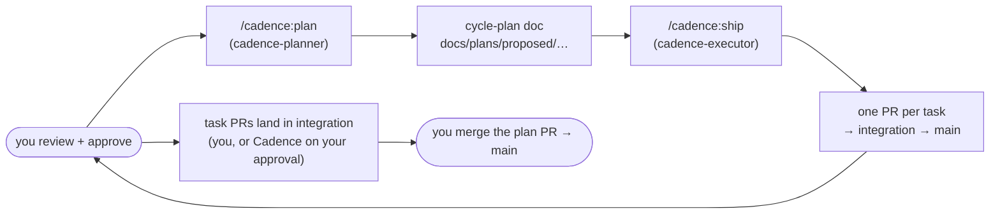
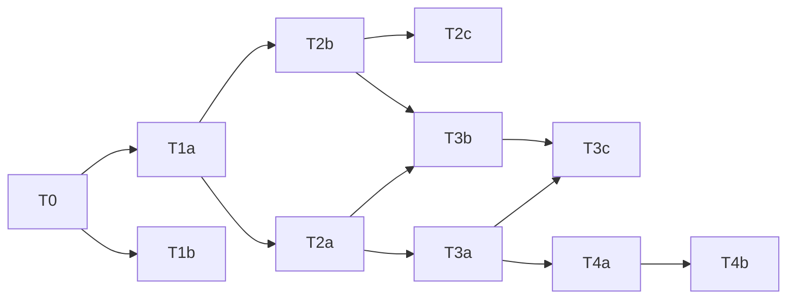
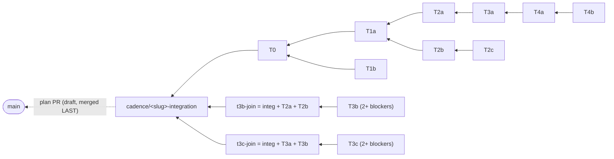
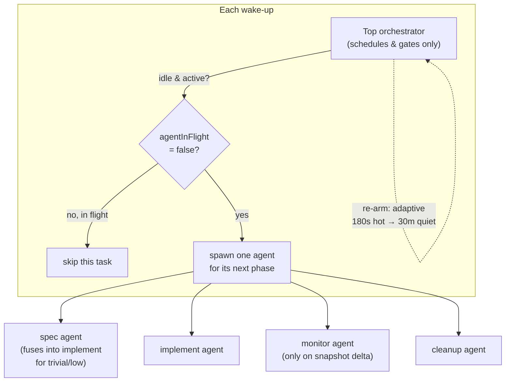
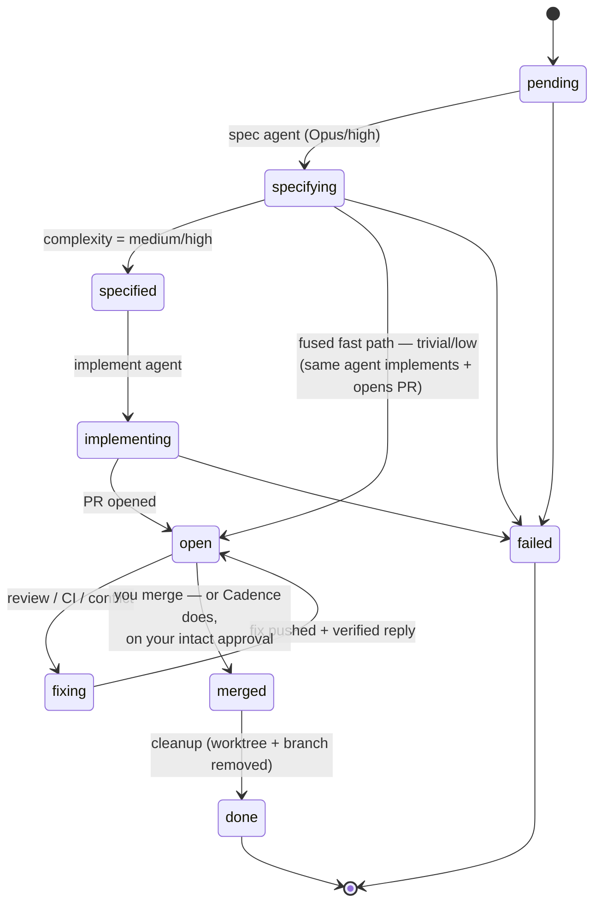
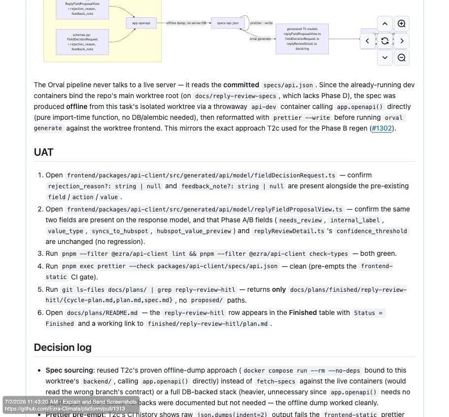
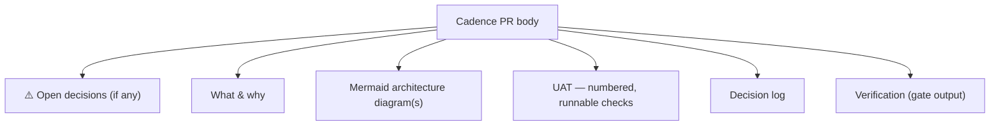

# Cadence

**A plan → ship pipeline for dependency-aware, parallel development cycles.**

Cadence takes a pile of tasks, works out which ones can safely run at the same time,
and drives each one to a merged pull request — one dedicated agent, one branch, one PR
per task. It never pushes to `main`, and it never merges the plan PR into `main` — that
gate is always yours. A **task** PR it will merge, but only on your terms: an approving
review from you is the authorization, and only while that approval still stands and
still describes the code (see [Approval-authorized auto-merge](#approval-authorized-auto-merge)).

| | |
|---|---|
| **Plugin** | `cadence` (in the `hsb` marketplace) |
| **Install** | `/plugin install cadence@hsb` |
| **Commands** | `/cadence:plan` (schedule), `/cadence:ship` (execute) |
| **Skills** | `cadence-planner`, `cadence-executor` |
| **Requires** | Claude Code · `gh` CLI (authed) · **the `superpowers` plugin (hard requirement)** |
| **Optional** | [`graphifyy`](https://github.com/Graphify-Labs/graphify) — local code knowledge graph that makes analysis cheaper and dependency detection deterministic |

---

## Contents

- [Why Cadence](#why-cadence)
- [Mental model](#mental-model)
- [Requirements](#requirements)
- [Quick start](#quick-start)
- [Core concepts](#core-concepts)
- [Worked example](#worked-example) — a real dependency graph, its waves, and its PRs
- [`/cadence:plan`](#cadenceplan)
- [`/cadence:ship`](#cadenceship)
- [Execution model](#execution-model)
- [Task lifecycle](#task-lifecycle)
- [Draft, readiness, and merging](#draft-readiness-and-merging) — including [approval-authorized auto-merge](#approval-authorized-auto-merge)
- [Open decisions](#open-decisions--questions-you-can-actually-answer) — questions you can actually answer
- [Anatomy of a Cadence PR](#anatomy-of-a-cadence-pr)
- [Models & complexity](#models--complexity)
- [Reviews: judge before you act](#reviews-judge-before-you-act)
- [State model](#state-model)
- [Safety invariants](#safety-invariants)
- [Tracker integration](#tracker-integration)
- [FAQ](#faq)
- [Glossary](#glossary)

---

## Why Cadence

Batch a handful of tasks onto one branch and you get merge conflicts, a PR nobody can
review, and no idea what depended on what. Run them one at a time and you waste the
parallelism that independent tasks give you for free.

Cadence sits in the middle. It reads the *actual* codebase to learn what each task
touches, derives the real dependency graph from those touch sets (not just from what you
declared), and schedules the work into **waves** of tasks that are safe to run
concurrently. Then it executes every task in its own isolated worktree and opens a
focused PR whose base branch encodes its dependencies — so review stays small and the
history stays legible.

Two skills, one hand-off:

- **`cadence-planner`** decides *what can run in parallel*. Plan-only.
- **`cadence-executor`** *makes it happen*, then babysits every PR — answering reviews,
  fixing CI, rebasing on moving bases — until it lands. You review; it merges a task PR
  once you've approved it, and hands you the final merge into `main`.

---

## Mental model


```mermaid
flowchart LR
  A["Task list<br/>Linear / Jira / markdown"] --> P["/cadence:plan<br/>(cadence-planner)"]
  P --> D["cycle-plan doc<br/>docs/plans/proposed/…"]
  D --> S["/cadence:ship<br/>(cadence-executor)"]
  S --> R["one PR per task<br/>→ integration → main"]
  R --> A(["you review + approve"])
  A --> M["task PRs land in integration<br/>(you, or Cadence on your approval)"]
  M --> H(["you merge the plan PR → main"])
```

The hand-off is a **file**, not memory. The planner writes a cycle-plan doc and records
a `Slug` and `Task-id` in its metadata header; the executor reads those from the
content. You can inspect, edit, or version the plan before a single line of code is
written.

---

## Requirements

Cadence does not work alone. The executor's preflight gate checks these before a
single task is dispatched:

| Dependency | Status | Why | If missing |
|---|---|---|---|
| **`superpowers` plugin** | **Required** | Per-task agents run `superpowers:*` skills end to end — worktrees, brainstorming, writing-plans, TDD, verification, receiving-code-review | The run **stops at preflight** with install instructions. Install it first — a run without it fails midway in confusing ways |
| **`gh` CLI, authenticated** | Required | All PR creation, replies, and thread resolution go through `gh` | The run stops at preflight (`gh auth login`) |
| **Tracker MCP server** (Linear/Jira/…) | Required *only for linked runs* | Status mirroring needs write access | The run stops at preflight for linked plans; unlinked plans don't need it |
| **`graphifyy`** | Optional | Local tree-sitter code knowledge graph — spec/planner analysis queries it (`graphify query/path/explain`) instead of exploring files, at zero LLM cost | Nothing breaks — analysis falls back to reading files. Install: `uv tool install graphifyy` |

---

## Quick start

```
/plugin marketplace add hugo-hsbtech/hsb-plugin-marketplace
/plugin install cadence@hsb
/plugin install superpowers   # required — from the superpowers marketplace
uv tool install graphifyy     # optional — cheaper, deterministic code analysis
```

Plan a cycle from a task list:

```
/cadence:plan
- Add reply-correlation matcher
- Wire matcher into the inbound pipeline (depends on the matcher)
- Add a metrics dashboard
```

Cadence analyzes the repo, writes a wave schedule to
`docs/plans/proposed/<timestamp>-<slug>.md`, and stops. Review it, then ship:

```
/cadence:ship docs/plans/proposed/20260706-1200-<slug>.md
```

From here it runs autonomously — opening branches and PRs, marking them ready when they
are, answering review comments, fixing CI, rebasing on moving bases — and re-arms itself
on a scheduled loop until everything has landed. Approve a task PR and it merges that one
for you; the final merge into `main` is yours. Every turn ends with what (if anything)
needs you.

---

## Core concepts

**Touch set** — for each task, the files and surfaces it *creates*, *edits*, *reads*,
and *shares* with other tasks. Computed by fanning out `Explore` subagents over the real
codebase, not guessed from the task title.

**Dependency graph** — edges come from three sources: dependencies you *declared*,
*producer→consumer* links (task B reads a file task A creates), and *write-write
conflicts* (two tasks edit the same surface). When two tasks would collide, Cadence
serializes them rather than gamble.

**Wave** — a topological level of the graph: every task in a wave is independent of the
others in that wave, so the whole wave can run at once. Wave *N* can start once wave
*N-1*'s branches exist.

**Integration branch** — `cadence/<slug>-integration`, cut from `main`. It holds the
plan docs and is the convergence point every task ultimately lands on. It opens as a
**draft plan PR → `main`**, which the human merges **last**.

**Stacked PRs** — a task's PR base encodes its dependency:

- **0 blockers** → base = the integration branch.
- **exactly 1 blocker** → base = that blocker's branch (a *stacked* PR).
- **2+ blockers** → base = a **join branch** built for that task: integration with every
  one of its blockers' branches merged in. Cross-blocker conflicts are resolved there,
  once. When all its blockers have landed in integration the join carries nothing
  unique, so the PR is re-targeted to integration and the join branch is deleted.

**Flow, don't gate** — a task starts the moment the branches it depends on *exist*, not
when their PRs *merge*. Work never freezes waiting on a human to click merge;
dependencies are expressed by PR base, and rebases carry changes forward as bases
advance. Every tick a **flow audit** classifies why each unfinished task isn't moving,
and anything held up "waiting for a merge" is treated as a defect to fix on the spot —
by building or refreshing a join, rebasing, or re-targeting the PR.

**Open decision** — a question the run genuinely cannot settle from the code, the plan,
or repo convention: product intent, a policy tradeoff, ambiguous acceptance criteria, an
irreversible choice. Rather than burying a guess in the decision log, Cadence posts it on
the PR as a numbered question with real options and a provisional default, pins it at the
top of the PR body, keeps the PR in draft while it's blocking, and repeats it in every
run summary with the link where you answer it. Everything it *can* decide, it decides.

**Draft** means *not reviewable yet* — an agent is still working, the gate or CI is red,
the self-review hasn't run, the body isn't written, or a blocking decision is open. It
does **not** mean "not mergeable yet": a stacked PR is reviewable, and says
`Stacked on #N — merge after it` in its body. Cadence un-drafts a PR itself the moment
the readiness checklist passes, and never asks you whether it should.

---

## Worked example

Take a cycle of eleven tasks with this dependency graph:


```mermaid
graph LR
  T0 --> T1a
  T0 --> T1b
  T1a --> T2a
  T1a --> T2b
  T2b --> T2c
  T2a --> T3a
  T2a --> T3b
  T2b --> T3b
  T3a --> T3c
  T3b --> T3c
  T3a --> T4a
  T4a --> T4b
```

### It levels into waves

Each wave is a set of tasks with no dependency on each other — they run concurrently:

| Wave | Tasks | Runs after |
|---|---|---|
| 1 | `T0` | — |
| 2 | `T1a`, `T1b` | T0 |
| 3 | `T2a`, `T2b` | T1a |
| 4 | `T2c`, `T3a`, `T3b` | T2a / T2b |
| 5 | `T3c`, `T4a` | T3a / T3b |
| 6 | `T4b` | T4a |

**Critical path:** `T0 → T1a → T2a → T3a → T4a → T4b` (six deep) — the shortest possible
wall-clock even with unlimited parallelism.

### Each task's PR base is derived from its blockers

This is *how a PR is created* in Cadence — the base branch is not a choice, it falls out
of the graph:

| Task | Blockers | PR base | Kind |
|---|---|---|---|
| `T0`  | —          | `cadence/<slug>-integration` | root |
| `T1a` | T0         | `T0`'s branch                | stacked |
| `T1b` | T0         | `T0`'s branch                | stacked |
| `T2a` | T1a        | `T1a`'s branch               | stacked |
| `T2b` | T1a        | `T1a`'s branch               | stacked |
| `T2c` | T2b        | `T2b`'s branch               | stacked |
| `T3a` | T2a        | `T2a`'s branch               | stacked |
| `T3b` | T2a, T2b   | `cadence/<slug>-t3b-join` (= integration + T2a + T2b) | join |
| `T3c` | T3a, T3b   | `cadence/<slug>-t3c-join` (= integration + T3a + T3b) | join |
| `T4a` | T3a        | `T3a`'s branch               | stacked |
| `T4b` | T4a        | `T4a`'s branch               | stacked |

### Which produces this branch/PR topology

Every arrow is *"this PR targets that base."* The plan PR is drawn dashed; the human
merges it into `main` last.


```mermaid
graph RL
  main([main])
  integ["cadence/&lt;slug&gt;-integration"]
  integ -. "plan PR (draft, merged LAST)" .-> main

  T0["T0"] --> integ
  T1a["T1a"] --> T0
  T1b["T1b"] --> T0
  T2a["T2a"] --> T1a
  T2b["T2b"] --> T1a
  T2c["T2c"] --> T2b
  T3a["T3a"] --> T2a
  J3b["t3b-join = integ + T2a + T2b"] --> integ
  T3b["T3b (2+ blockers)"] --> J3b
  J3c["t3c-join = integ + T3a + T3b"] --> integ
  T3c["T3c (2+ blockers)"] --> J3c
  T4a["T4a"] --> T3a
  T4b["T4b"] --> T4a
```

A join branch is plumbing, not a deliverable: it never gets a PR of its own, and it is
deleted once its blockers have all landed in integration (at which point that task's PR
is re-targeted straight at integration).

Each task PR lands in integration as it goes green — merged by you, or by Cadence once
you've approved it — and then **you** merge the single plan PR into `main` at the end.

---

## `/cadence:plan`

Turn tasks into a wave schedule. **Plan-only** — it never implements or dispatches.

```
/cadence:plan <task list | Linear key | Jira key | path to plan doc>
```

**Input resolution:**

- *Empty* → prompts you for tasks.
- *Linear key* (e.g. `ABC-1234`) → fetches the issue, its sub-issues, and blocker links.
- *Jira key* (e.g. `PROJ-123`) → fetches the issue, sub-tasks, and link relations.
- *File path* → reads that plan doc.
- *Otherwise* → parses free-text / markdown.

**What it does:**

1. Normalizes tasks to stable IDs (`T1`, `T2`, …) with summaries and declared deps.
2. Deep codebase analysis — parallel `Explore` subagents compute each task's touch
   set. With `graphifyy` installed, the graph is refreshed once and subagents query
   it first (`graphify query/path/explain`) — deterministic dependency evidence at
   zero LLM cost, instead of exploratory file reading.
3. Builds the dependency graph (declared + producer→consumer + write-write conflict);
   graphify import/call edges, when present, are the preferred evidence.
4. Levels tasks into waves by topological sort; computes the critical path.
5. Emits the cycle plan to `docs/plans/proposed/<YYYYMMDD-HHMM>-<slug>-<task-id>.md`
   (`<task-id>` = the source tracker key, or `cycle` for free-text), recording
   `Slug` / `Task-id` / timestamp in the metadata header.

Then it stops and presents the schedule. When in doubt about a conflict, it serializes.

---

## `/cadence:ship`

Execute a cycle plan end to end.

```
/cadence:ship <path to a cycle-plan .md>   # empty → uses the plan in context, or run /cadence:plan first
```

It runs as a **thin top orchestrator** that delegates each task to its own agent. It does
not implement, monitor, or fix anything itself — it only schedules, gates, and re-arms.

1. **Preflight gate (blocking).** Verifies the **superpowers plugin is installed**
   (hard stop with install instructions if not), detects optional `graphifyy`,
   then verifies `gh` auth + account, the target repo, and any required MCP servers
   (the tracker's server must have write access if tasks are linked). Fails loud and
   stops if something's missing — nothing dispatches until the gate passes. The gate
   is re-verified only before dispatching *new* build work; pure monitor ticks skip
   the ceremony.
2. **Opens the run.** Creates the integration branch *as a worktree*, sweeps the plan/
   design docs off `main` and commits them there (leaving `main` clean), and opens the
   draft plan PR → `main`.
3. **Ticks.** Each wake-up it first runs **change detection** — one batched read-only
   GraphQL call over all the cycle's PRs, diffed against a stored snapshot — then a
   **flow audit** (why is each unfinished task not moving? anything "waiting for a
   merge" gets converted on the spot), then spawns exactly one agent per *idle active*
   task **that has something to do** and re-arms an **adaptive** `ScheduleWakeup` loop.
   A fully quiet tick costs one API call and zero agent spawns. It ends only when the
   plan PR is merged and every task is `done` / `failed`.
4. **Reports honestly, every turn.** Each PR's real state (draft *and why*, awaiting
   review, awaiting your decision, approved, merged) plus a **"needs you"** list —
   every open decision with the link where you answer it, any review loop parked after
   3 rounds, any failed task, and the plan PR once it's ready. If nothing needs you, it
   says so in one line.

---

## Execution model

Two levels, and agents are **re-spawned every tick** rather than kept alive — monitoring a
cycle can span days, and an agent lives only one turn. Continuity lives in the durable
worktree + task file, not in a long-running process.


```mermaid
flowchart TD
  subgraph Tick["Each wake-up"]
    O["Top orchestrator<br/>(schedules & gates only)"]
    O -->|"idle & active?"| G{"agentInFlight<br/>= false?"}
    G -->|no, in flight| SKIP["skip this task"]
    G -->|yes| SP["spawn one agent<br/>for its next phase"]
  end
  SP --> A1["spec agent<br/>(fuses into implement<br/>for trivial/low)"]
  SP --> A2["implement agent"]
  SP --> A3["monitor agent<br/>(only on snapshot delta)"]
  SP --> A4["cleanup agent"]
  O -.->|"re-arm: adaptive<br/>180s hot → 30m quiet"| O
```

**Idle-gating** is the core rule: act on a task only when it has no agent mid-flight. A
task whose agent is `specifying` / `implementing` / `fixing` is skipped so you never tick
a PR mid-round-trip. Only a settled `open` PR gets a monitor tick.

**Change detection** keeps quiet monitoring nearly free: each tick starts with one
batched read-only GraphQL call over all the cycle's open PRs (head SHA, `updatedAt`,
review decision, CI rollup, merge state), diffed against a snapshot in `run.json`. A
PR with no delta spawns **no** agent. And the wake-up interval itself **backs off**
— 180s while anything is hot, doubling per quiet tick up to 30 minutes while
everything is parked on humans; any activity snaps it back to 180s. Together these
cut multi-day monitoring cost by an order of magnitude versus fixed-interval,
always-spawn polling.

**Flow audit** is the anti-freeze check. Every tick, each unfinished task is labelled
with *why* it isn't advancing: dispatchable, agent in flight, awaiting human review,
awaiting a human decision, blocked by a failed dependency, or waiting for a blocker's
branch to appear. Those are all legitimate. **"Waiting for a merge" is not** — it's
treated as a defect and fixed the same tick by building or refreshing a join branch,
rebasing, or re-targeting the PR. A task stuck on the same non-dispatchable reason for
three consecutive ticks is recorded and surfaced, so a stalled cycle says so instead of
quietly sleeping.

Each per-task agent owns one durable git worktree and one descriptive branch
(`cadence/<slug>-t<id>-<task-slug>`), and is the **sole writer** of its own task file. It
advances its task exactly one step per tick and does all its own `gh` work.

---

## Task lifecycle


```mermaid
stateDiagram-v2
  [*] --> pending
  pending --> specifying: spec agent (Opus/high)
  specifying --> specified: complexity = medium/high
  specifying --> open: fused fast path — trivial/low<br/>(same agent implements + opens PR)
  specified --> implementing: implement agent
  implementing --> open: PR opened
  open --> fixing: review / CI / conflict
  fixing --> open: fix pushed + verified reply
  open --> merged: you merge — or Cadence does,<br/>on your intact approval
  merged --> done: cleanup (worktree + branch removed)
  pending --> failed
  specifying --> failed
  implementing --> failed
  done --> [*]
  failed --> [*]
```

`specifying` / `implementing` / `fixing` are *in-flight* states — the orchestrator skips
them. `specified` and `open` are *settled, idle* states — the next tick acts.

`open` covers both draft and ready-for-review: the draft flag is re-evaluated against
the readiness checklist on every tick, and the PR un-drafts itself the moment it passes.

---

## Draft, readiness, and merging

**Cadence decides its own draft state. It will never ask you whether to mark PRs ready
for review** — that's a mechanical checklist, not a judgment call, and asking it (or
worse, reporting a cycle as "ready for review" while every PR sits in draft) is treated
as a bug.

A PR is a draft only while a reviewer would be wasting their time on it:

| Draft because… | Clears when… |
|---|---|
| an agent still has work in flight | the agent returns |
| local gate or CI is red | the gate/CI goes green |
| the complexity-scaled self-review hasn't run | it runs (`trivial` doesn't need one) |
| an **open blocking decision** is unanswered | you answer it |
| the PR body isn't written to standard | it is |

Being **stacked on an unmerged base is not on that list** — a stacked PR is perfectly
reviewable, and merging it puts its code into its blocker's branch, which is exactly
where it belongs. The stacking is stated in words (`Stacked on #123 — merge after it`),
not hidden behind a draft flag.

### Approval-authorized auto-merge

Once you approve a task PR, waiting for you to also click **Merge** just parks finished
work. So your approval *is* the authorization: the task's own agent merges the PR into
its base — but only if every one of these still holds at merge time, re-checked in the
same tick:

| Guard | Why |
|---|---|
| a **human** approval exists | a bot approval never authorizes a merge on its own |
| the approval still stands | not dismissed, no later `CHANGES_REQUESTED` |
| **the approval still describes the code** | head is identical to the approved SHA, or differs only by a pure rebase or a comment/doc/formatting-only edit — any logic, test, config, dependency, migration, or CI change makes it **stale** (and when in doubt, it's stale) |
| no open decision — blocking or not | you haven't been asked something that's still unanswered |
| every comment answered, every fixed thread resolved | nothing left hanging |
| CI fully green, cleanly mergeable | no failing/pending checks, no conflicts |
| it's a **task** PR | the plan PR → `main` is **never** auto-merged |
| its base is landable | merging a stacked PR into a parent branch whose PR is still open would smuggle unreviewed commits into that parent — so an approved stacked PR waits for its base to land (its dependents keep building on it meanwhile), and a join-based PR is re-targeted to integration first |

Before merging it posts the authorization on the PR — who approved, at which SHA, what
changed since, which guards passed — so the merge is auditable from the PR itself. If a
guard fails it doesn't merge and doesn't go quiet: it comments with the exact guard that
failed and re-requests review where that's the fix.

Set `approvalMergePolicy: "off"` in the run state (or just say so when you ship) if you'd
rather click the button yourself. Either way, **the plan PR into `main` is always yours.**

---

## Open decisions — questions you can actually answer

Cadence is autonomous about *process* and honest about *intent*. Anything it can settle
from the code, the plan, or repo convention it settles itself, records in the PR's
decision log with a roll-back note, and moves on.

But some questions can't be settled that way: which behavior you actually want, a policy
or business tradeoff, contradictory acceptance criteria, an irreversible migration, a
security tradeoff. Those used to become a quiet default buried in a log — and sometimes
shipped with the question never really asked. Now each one becomes an **open decision**:

1. It keeps building with a provisional default, so nothing stalls.
2. It posts the question on the PR — numbered `D1`, `D2`, with 2–4 concrete options,
   what's in effect right now, the blast radius, and how to answer (`reply D1: B`).
3. It pins the question at the top of the PR body, linked to that comment.
4. It requests your review so it lands in your queue, and comments on the linked issue.
5. If it's **blocking**, the PR stays a draft and cannot be auto-merged until answered.
6. It repeats in the **"needs you"** list of every run summary, with the answer link.

When you answer — even tersely — it implements your answer if it differs from the
default, replies with the commit, resolves the thread, strikes the line from the PR body,
and re-runs the readiness checklist (clearing the last blocking decision is usually what
makes a PR ready). One reminder is posted if a blocking decision goes stale; after that
it lives in the summary rather than nagging the PR.

If you merge a PR anyway with a decision still open, it isn't lost: Cadence comments on
the merged PR naming the default that therefore shipped and how to change it, and carries
it into the final run summary as a follow-up.

---

## Anatomy of a Cadence PR

Every PR is written **for a human who has not been following the cycle** — didactic,
self-contained, and sized to the task's complexity.

A real high-complexity Cadence PR — note the embedded architecture diagram, the numbered
**UAT** with exact commands, and the **Decision log** capturing each autonomous choice:



A rich task gets the full body:

- **⚠️ Open decisions** — *first, whenever any exist*: each numbered question, what's in
  effect meanwhile, and a link to the comment where you answer it. The only section kept
  up to date after the PR opens.
- **What & why** — plain-language summary of the change and its purpose.
- **Architecture** — one or more **Mermaid diagrams** of the data/flow the change adds.
- **UAT** — a numbered checklist of acceptance tests with the *exact* commands to run
  (lint, type-check, targeted tests, file-existence assertions) and the expected result.
- **Decision log** — every non-trivial autonomous choice as
  `{decision, chosen, alternatives, why, howToRollback}`.
- **Verification** — the gate that was actually run, with output.


```mermaid
flowchart TD
  PR["Cadence PR body"] --> OD["⚠️ Open decisions (if any)"]
  PR --> W["What & why"]
  PR --> M["Mermaid architecture diagram(s)"]
  PR --> U["UAT — numbered, runnable checks"]
  PR --> DL["Decision log"]
  PR --> V["Verification (gate output)"]
```

**Scaled to complexity:** a `trivial` / `low` one-file change gets a few sentences — no
Mermaid, no full template. Only `high` (and rich `medium`) tasks get the full treatment
above. Siblings are always referenced by **PR number + one-line description**, never a
bare task id. A PR opens as a **draft** while it isn't reviewable yet (agent in flight,
red gate/CI, self-review not run, unwritten body, unanswered blocking decision) and
un-drafts itself as soon as that clears — see
[Draft, readiness, and merging](#draft-readiness-and-merging).

---

## Models & complexity

The model is chosen by **what the agent is doing**, and each task's `complexity` is an
*output of the spec phase* — not assigned up front.

| Phase | What it does | Model + effort |
|---|---|---|
| **spec** | verifies + extends the plan's brief, *decides `complexity`*; **implements in the same invocation when trivial/low** | **Opus, high** — always |
| **implement** — `high` | TDD build of the most complex tasks | Opus, medium |
| **implement** — `medium` | TDD build of lighter tasks | Sonnet |
| **implement** — `low` / `trivial` | normally absorbed by the fused spec agent; spawned separately only to resume an interrupted run | Sonnet, low |
| **monitor / fix / cleanup** | read PR state, reply, small fixes, teardown | Sonnet, low |

> *Think on Opus, do routine work on Sonnet.* Analysis is never run on a cheap model; the
> whole cycle is never parked on Opus "to be safe."

Two efficiency rules shape the spec phase. It **consumes the planner's context brief**
(touch set + requirements, already produced by Opus-tier analysis) — verifying it
against current code rather than re-deriving it, using graphify queries when the graph
exists, and escalating to sub-agents only on real drift. And when it lands on
`trivial`/`low`, it **fuses straight into implementation** — one agent spawn instead of
two, no context re-derivation, and the small change is built on the stronger model
anyway.

**Complexity tiers** — `high | medium | low | trivial`. `trivial` means *no logic or
behavior change* (a typo, a lint/format fix, a comment/doc edit).

**Pre-push self-review gate.** After the green lint/format/tests gate and *before* the PR
is pushed, the implement agent reviews its own **branch diff** (never the whole repo),
scaled to complexity:

| complexity | pre-push review |
|---|---|
| `trivial` | **skipped** — the gate is the whole bar (keep quick fixes quick) |
| `low` / `medium` | `/code-review low` |
| `high` | `/code-review high` |

Findings are judged, not blindly obeyed; real ones are fixed and the gate re-run. The
self-review runs **exactly once** — after fixes, only the lint/format/tests gate is
re-run, never a second `/code-review`. (A review at this depth almost always finds
*something* new, so re-reviewing after every fix would loop forever and the task would
never open its PR.)

---

## Reviews: judge before you act

Cadence treats every review comment, CI failure, and conflict as a *suggestion to
evaluate on the merits* — never a command:

- **Agree** → make the change.
- **Better alternative** → do it differently, and say why.
- **Wrong / out of scope** → decline, with a reasoned reply.
- **Ambiguous** → ask.

**No silent fixes.** Every change made in response to a comment/CI/conflict must get a
real, *verified-posted* `gh` reply (URL captured) before it counts as handled. Agreed-and-
fixed items also resolve their thread and re-request the reviewer. This is separate from
the pre-push self-review above — that one runs before the PR exists.

**Bounded fix rounds (review convergence).** An automated reviewer re-reviews every push
and usually finds *something* new each time, so fix → re-request → new review could churn
forever. Cadence caps it at **3 fix rounds per reviewer** (tracked per task in
`reviewerFixRounds`): after that, the agent stops re-requesting that reviewer, posts one
summary comment (what was fixed, what was declined and why), and parks the remaining
findings for the human — the PR goes quiet and the adaptive backoff takes over. The cap
is per reviewer (humans and other reviewers are unaffected) and never blocks fixing
genuinely broken code — red CI, conflicts, and real bugs are always fixed.

---

## State model

Run state lives under `.cadence/cycles/<YYYYMMDD-HHMM>-<6char-hash>-<slug>-cycle/`. Add
`.cadence/` to the target repo's `.gitignore` — cycle state is never committed. It's a
*directory*, not one file, because parallel agents would clobber shared JSON. Ownership is
strict:

| File | Sole writer | Holds |
|---|---|---|
| `run.json` | the **orchestrator** | roster, wave schedule, preflight gate, integration/plan-PR pointers, `prTitlePattern`, `modelPolicy`, `agentInFlight` flags, `prSnapshot` (change-detection baselines), `monitorBackoff` (adaptive interval), `approvalMergePolicy`, `attention` (what needs you), `stalls`, `unresolvedDecisions` |
| `tasks/<id>.json` | that **task's agent** | its status, branch (+ `joinBranch` when it has 2+ blockers), worktree, PR number, `isDraft`/`draftReason`, `pendingDecisions`, `approvals` (with the approved SHA), `autoMerge`, `answeredComments` (with `replyUrl` proof), and `decisionLog` |

Full schema and field notes:
[`skills/cadence-executor/references/execution-state.md`](skills/cadence-executor/references/execution-state.md).

---

## Safety invariants

These never bend:

- **Never pushes or commits to `main`.** All work is on per-task branches and the
  integration branch.
- **Never merges the plan PR into `main`.** That gate is always yours — there is no
  policy, approval, or setting that hands it over.
- **Merges a task PR only on a live human authorization.** Either your approving review
  with every guard intact (approval not superseded, not stale against the code, no open
  decision, all comments answered, CI green, cleanly mergeable), or an explicit scoped
  grant you gave the run. Never a bot approval alone, and never to end a disagreement.
- **Never merges silently.** Every auto-merge posts its authorization on the PR first —
  who approved, at which SHA, what changed since, which guards passed.
- **Never ships a pending question silently.** Anything it can't settle becomes an open
  decision: posted answerably on the PR, blocking readiness and auto-merge, and repeated
  in every run summary until you answer it.
- **One agent and one PR per task.** Tasks are never combined onto a shared branch/PR.
- **Never freezes on a merge.** Dependencies are expressed by PR base — stacked, joined,
  or integration — and the flow audit converts any "waiting for a merge" every tick.
- **The plan PR merges last**, into `main`, by a human.
- **Monitoring uses only the in-session `ScheduleWakeup` loop** — never cron or any
  external/paid scheduler. The loop is adaptive (backs off while quiet) but never
  stops while a PR is open.
- **The orchestrator's own GitHub access is read-only change detection.** All triage,
  replies, pushes, and judgments happen inside per-task agents.

---

## Tracker integration

When tasks carry Linear / Jira / GitHub Issue keys, Cadence mirrors status into the
tracker as it runs — `In Progress` when a task starts, `In Review` when its PR opens,
`Done` on merge, `Blocked` if its gate can't go green. The tracker's MCP server is
*required* (with write access) for a linked run and is checked at the preflight gate.

---

## FAQ

**Does it merge anything for me?** A **task** PR, yes — but only after *you* approve it,
and only while that approval still stands and still describes the code (see
[the guards](#approval-authorized-auto-merge)). The **plan PR into `main` is never
merged for you**, under any setting. Prefer clicking every button yourself? Set
`approvalMergePolicy: "off"`.

**I approved a PR, then it pushed a commit — will it still merge?** Only if that commit
was a pure rebase or a comment/doc/formatting-only edit. Any change to logic, tests,
config, dependencies, migrations, or CI makes your approval **stale**: it won't merge,
it says so on the PR, and it re-requests your review. When it can't tell, it treats the
approval as stale.

**What if two tasks touch the same file?** The planner detects the write-write conflict
from the touch sets and serializes them across waves instead of running them in parallel.

**A blocker's PR isn't merged yet — is its dependent stuck?** No. Dependents start as
soon as the blocker's *branch* exists: one blocker → the dependent stacks its PR on that
branch; several blockers → it builds a **join branch** carrying all of them and works on
top of that. Both rebase as their bases advance. Cadence flows, it doesn't gate on merges
— and the per-tick flow audit treats "waiting for a merge" as a defect to fix, not a
state to sit in.

**Everything is a draft and nothing is reviewable — why?** That shouldn't happen any
more. Draft now means *not reviewable yet* (agent working, red CI, self-review not run,
unwritten body, unanswered blocking decision) — being stacked on an unmerged base no
longer keeps a PR hidden. Each PR un-drafts itself the moment its checklist passes, and
the run summary always reports each PR's real state instead of a blanket "ready".

**Will it ask me to mark PRs ready for review?** No. That's its call, from a fixed
checklist, and asking you would be a bug. What it *will* ask — asynchronously, on the PR
— is a genuine **open decision** it can't settle: a product or policy question, with
options and a default already in effect, plus the link where you answer it. Those show
up in the "needs you" list of every summary.

**Where did my plan docs go?** Onto the integration branch. When the run opens, Cadence
sweeps the cycle's generated docs off your `main` working tree and commits them on the
integration branch, leaving `main` clean.

**Can I edit the plan before shipping?** Yes — that's the point of the file hand-off.
Edit the cycle-plan doc, then run `/cadence:ship` on it.

**It stopped at preflight.** A required precondition failed — most often the
**superpowers plugin isn't installed**, `gh` auth is missing/wrong-account, or a
linked tracker's MCP server is unauthenticated. Fix exactly what it named and re-run
`/cadence:ship <plan>`.

**Do I need graphifyy?** No — it's optional. With it, planner and spec analysis query
a local code graph (cheaper, deterministic dependency evidence); without it, they read
files the classic way. Install with `uv tool install graphifyy` if you want faster,
cheaper cycles.

**Why did the wake-ups slow down overnight?** By design. The monitor loop backs off
(180s → up to 30 min) while nothing changes, and quiet ticks spawn no agents — that's
what keeps a multi-day cycle affordable. Any comment, CI result, push, or merge snaps
it back to 180s on the next tick.

---

## Glossary

| Term | Meaning |
|---|---|
| **Touch set** | files a task creates / edits / reads / shares, from real codebase analysis |
| **Wave** | a topological level — tasks safe to run concurrently |
| **Critical path** | the longest dependency chain; the floor on wall-clock time |
| **Integration branch** | `cadence/<slug>-integration`; the convergence point + plan-doc home |
| **Plan PR** | the draft PR from the integration branch → `main`, merged last by a human |
| **Stacked PR** | a task PR based on its single blocker's branch |
| **Join branch** | `cadence/<slug>-t<id>-join` — integration + every blocker's branch, the synthetic base that lets a multi-blocker task start immediately; retired once its blockers land |
| **Flow audit** | the per-tick check that no task is stalled "waiting for a merge" |
| **Open decision** | a question only a human can answer, posted answerably on the PR; blocks readiness and auto-merge until resolved |
| **Readiness checklist** | the five conditions that decide draft vs. ready — Cadence's call, never a question to the user |
| **Approval-authorized auto-merge** | a human approval on a task PR authorizes its agent to merge it, while every guard still holds |
| **Idle-gating** | acting on a task only when it has no agent in flight |
| **Complexity** | `high / medium / low / trivial`; set by the spec phase; drives model + review depth |
| **Change detection** | one batched read-only GraphQL snapshot per tick; no delta → no agent spawned |
| **Fused fast path** | a spec agent that finds `trivial`/`low` implements + opens the PR in the same invocation |
| **Quiet tick** | a tick with no deltas, spawns, or in-flight agents; doubles the wake-up interval (max 30 min) |

---

*Part of the [`hsb`](../../README.md) marketplace. This document is the deep-dive
reference for Cadence; the skill files under `skills/` are the source of truth for
behavior.*
