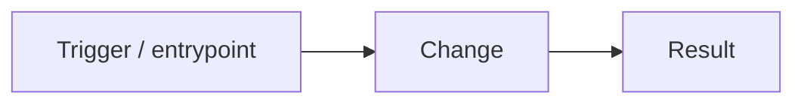

# PR body templates (cadence-executor)

Write for a human who has **not** been following the cycle. Be didactic and succinct:
say what changed and how to test it in plain language, and don't bury the reader in
internal cross-references. **Match the body's size to the task's `complexity`** — pick
the Simple body for a `low`/small change, the Full body only for genuinely complex work.

> **References must be legible.** Never point at a bare internal id (`T2b`, "wave 2",
> "the matcher task"). When you reference sibling work, give the **PR number + a
> one-line description** — "builds on #123 (the reply-correlation matcher)". If a task
> id must appear, gloss it once: "T2 (PR #123 — the inbound pipeline)".

---

## Simple body — use for `complexity: low` (and small `medium`)

For a one-file / low-risk change. A few sentences is the whole PR. **No Mermaid, no
acceptance-criteria checklist, no multi-section scaffolding.**

```markdown
## What & why

<1–3 plain sentences: what this changes and the problem it solves.>
<If it builds on another PR, say so with the number: "Stacked on #123 (adds X).">

## How to test

<2–4 plain steps, or a single line if it's that simple. Setup → action → expected.>

<!-- Decision log ONLY if a real autonomous choice was made — otherwise delete this. -->
## Decisions

- **<the choice>** — chose <X> over <Y>; to change it, comment "<how>".
```

---

## Full body — use for `complexity: high` (and rich `medium`)

For changes that span multiple files/services or carry real design decisions.

```markdown
## What & why

<1–3 sentences: the demand in plain language — what problem this solves and for whom.>

**Task:** <T-id> · **Source:** <Linear/Jira key | plan path> · **Cycle:** <slug>, wave <n>
**Base:** `<baseBranch>` — <plain note: "the integration branch" or "stacked on #123 (adds X)">
**Acceptance criteria**
- [ ] <criterion 1>
- [ ] <criterion 2>

## How it works


<Add a sequence/architecture diagram only if the change spans services or async steps.>

<Short plain-language walkthrough of the approach and the key files touched.>

## UAT — how to test this

> Step-by-step so a non-author can verify it. Include setup + expected results.

1. **Setup:** <branch checkout / compose up / migrations / seed>
2. **Do:** <exact action — page to open, endpoint to call, command to run>
3. **Expect:** <observable result that proves it works>
4. **Edge case:** <one negative/edge path to try and its expected handling>

## Decision log (autonomous choices — roll back any of these)

> Succinct: one line per real choice — what was chosen, the alternative, and the
> off-ramp. Plain language, no implementation narration. Omit the table if there were
> no real choices.

| # | Decision | Chose (recommended) | Instead of | Roll back by |
|---|----------|---------------------|------------|--------------|
| 1 | <what>   | <chosen>            | <alt>      | comment "<how>" |

## Verification

- Lint/format: <result> · Tests: <suites + result> · Manual: <what you exercised, if any>

## Notes / risks

<Migrations, feature flags, follow-ups, anything the reviewer should watch. Keep short.>
```
