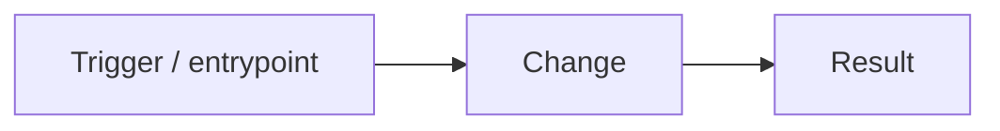
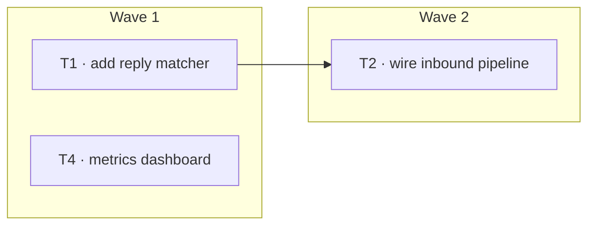
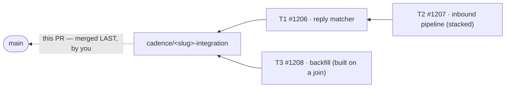

# PR body templates (cadence-executor)

Write for a human who has **not** been following the cycle. Be didactic and succinct:
say what changed and how to test it in plain language, and don't bury the reader in
internal cross-references. **Match the body's size to the task's `complexity`** — pick
the Simple body for a `low`/small change, the Full body only for genuinely complex work.

> ## DURABLE, NOT VOLATILE — the body is a description, not a dashboard
>
> A PR body is written once and read for days. **It must still be true next week.** So it
> carries *intent and judgment*, never live state — and above all never a number GitHub
> already renders and the next commit invalidates.
>
> | Never in the body (GitHub shows it live, and it rots) | Put this instead |
> |---|---|
> | "Files changed: 15" · line counts | scope in words: "touches `libs/storage/**` and its registration; nothing else" |
> | "42 tests passing" · coverage % · timings | what to run: "`nx test storage` (CI runs it)" |
> | "CI green" · "all checks pass" · "mergeable" | nothing — the checks tab is the truth |
> | "awaiting review" · "ready to merge" · draft state | nothing — the PR header says it |
> | "3 of 5 tasks merged" · "currently…" | nothing — referenced PRs render their own state |
>
> **Durable, and welcome:** what changed and why · scope in words · how to test (the
> commands, not their results) · decisions + how to roll them back · open decisions ·
> identity and base · risks, migrations, follow-ups · and **events with their reasons**
> ("#37 merged into the base and renamed the tables; the conflict was resolved keeping
> both intents") — those are history, not status, and history doesn't rot.
>
> Test: *would this sentence be wrong after one more commit?* If yes, it doesn't go in
> the body. If it still matters, it goes in a **comment**, where it reads as a timestamped
> event rather than a claim about the present.
>
> The one section deliberately kept current is **⚠️ Open decisions** — it's a live
> checklist by design, and it is struck through as each is answered.

> **References must be legible.** Never point at a bare internal id (`T2b`, "wave 2",
> "the matcher task"). When you reference sibling work, give the **PR number + a
> one-line description** — "builds on #123 (the reply-correlation matcher)". If a task
> id must appear, gloss it once: "T2 (PR #123 — the inbound pipeline)".

---

## Identity header — the FIRST line of every PR body, both sizes

Nobody should ever have to ask which PR belongs to which task. One line answers it:

```markdown
**T2 · Wire the matcher into the inbound pipeline** — cycle `reply-followups` · plan PR #1200 · ABC-1234 · base: stacked on #1206 (adds the matcher) — merge after it
```

- `**<T-id> · <what this task does, in plain words>**` — the title of the work, not an id.
- `cycle \`<slug>\`` · `plan PR #<n>` — where it belongs and where the cycle map lives.
- tracker key, if the task has one. **Never invent one.**
- `base:` in plain language — `the integration branch`, `stacked on #1206 (adds X) —
  merge after it`, or `a join of #1206 + #1207, whose conflicts are resolved here`.

Omit tokens that don't apply. **Cadence never labels a PR and never creates a label** —
the repo's label set belongs to its humans. The identity header and the plan PR's cycle
map are what make a PR findable.

---

## Open decisions block — goes at the TOP of either body, when any exist

The only section you keep updating after the PR is opened. Omit it entirely when there
are no open decisions. Each line links to the comment where the question is answered.

```markdown
## ⚠️ Open decisions

> These need a human. Answer in the linked comment (e.g. reply `D1: B`); this PR won't
> be marked ready or merged while a blocking one is open.

- **D1** (blocking) — Should expired invites be purged or archived? → [answer here](<commentUrl>) · *in effect: archive*
- ~~**D2** — Retry backoff: 3× or 5×?~~ → answered by @user: 5× · implemented in `abc1234`
```

---

## Simple body — use for `complexity: low` (and small `medium`)

For a one-file / low-risk change. A few sentences is the whole PR. **No Mermaid, no
acceptance-criteria checklist, no multi-section scaffolding.**

```markdown
**<T-id> · <what this task does>** — cycle `<slug>` · plan PR #<n> · <tracker key> · base: <plain note>

<!-- If there are open decisions, the ⚠️ Open decisions block goes here, right after the header. -->
## What & why

<1–3 plain sentences: what this changes and the problem it solves.>

## How to test

<2–4 plain steps, or a single line if it's that simple. Setup → action → expected.>

<!-- State the scope in WORDS if it's worth stating ("touches only x/y/**"). Never a
     file count — GitHub renders that live and it's wrong after the next commit. -->

<!-- Decision log ONLY if a real autonomous choice was made — otherwise delete this. -->
## Decisions

- **<the choice>** — chose <X> over <Y>; to change it, comment "<how>".
```

---

## Full body — use for `complexity: high` (and rich `medium`)

For changes that span multiple files/services or carry real design decisions.

```markdown
**<T-id> · <what this task does>** — cycle `<slug>` · plan PR #<n> · <tracker key> · base: <plain note>

<!-- If there are open decisions, the ⚠️ Open decisions block goes here, right after the header. -->
## What & why

<1–3 sentences: the demand in plain language — what problem this solves and for whom.>

**Source:** <Linear/Jira key | plan path> · **Cycle:** <slug>, wave <n>
**Base:** `<baseBranch>` — <plain note: "the integration branch", "stacked on #123
(adds X) — merge after it", or "a join of #123 + #124, whose conflicts are resolved here">
**Acceptance criteria**
- [ ] <criterion 1>
- [ ] <criterion 2>

## How it works


```mermaid
flowchart LR
  A[Trigger / entrypoint] --> B[Change]
  B --> C[Result]
```
<Add a sequence/architecture diagram only if the change spans services or async steps.>

<Short plain-language walkthrough of the approach and the key files touched.>

## UAT — how to test this

> Step-by-step so a non-author can verify it. Include setup + expected results.

1. **Setup:** <branch checkout / compose up / migrations / seed>
2. **Do:** <exact action — page to open, endpoint to call, command to run>
3. **Expect:** <observable result that proves it works>
4. **Edge case:** <one negative/edge path to try and its expected handling>

## Decision log (autonomous choices — roll back any of these)

> Succinct: one line per real choice — what was chosen, the alternative, and the
> off-ramp. Plain language, no implementation narration. Omit the table if there were
> no real choices.

| # | Decision | Chose (recommended) | Instead of | Roll back by |
|---|----------|---------------------|------------|--------------|
| 1 | <what>   | <chosen>            | <alt>      | comment "<how>" |

## Verification

- **To verify:** `<the lint / test commands a reviewer can run>` — CI runs the same.
  <Do NOT write pass counts, timings, or "all green": the checks tab is live, this text
  is not.>
- **Scope:** <in words — the areas this touches, e.g. "`libs/storage/**` plus its
  registration and tsconfig references; nothing outside it". No file counts. If the diff
  legitimately reaches beyond the obvious, say why here.>

## Notes / risks

<Migrations, feature flags, follow-ups, anything the reviewer should watch. Keep short.>
```

---

## Plan (integration) PR body — the cycle's home

The plan PR is where a human goes to understand the **shape** of the cycle, so it carries
the plan itself, not just a list. Written once at run open; the map table gains one row
per task as its PR opens; the diagrams are redrawn only if the *plan* changes.

```markdown
# Cycle: <slug>

<2–4 sentences: what this cycle delivers and why, in plain language.>

**Plan:** `docs/plans/proposed/<...>.md` · **Tasks:** <n> in <n> waves

## The plan

### Waves — what runs in parallel, and what waits


```mermaid
graph LR
  subgraph W1[Wave 1]
    T1["T1 · add reply matcher"]
    T4["T4 · metrics dashboard"]
  end
  subgraph W2[Wave 2]
    T2["T2 · wire inbound pipeline"]
  end
  T1 --> T2
```

### Branch topology — where each PR is based


```mermaid
graph RL
  main([main])
  integ["cadence/&lt;slug&gt;-integration"]
  integ -. "this PR — merged LAST, by you" .-> main
  T1["T1 #1206 · reply matcher"] --> integ
  T2["T2 #1207 · inbound pipeline (stacked)"] --> T1
  T3["T3 #1208 · backfill (built on a join)"] --> integ
```

## Task → PR map

| Task | What it does | PR | Base |
|---|---|---|---|
| T1 | Add the reply-correlation matcher | #1206 | integration |
| T2 | Wire the matcher into the inbound pipeline | #1207 | #1206 (stacked) |

## How this cycle closes

Each task PR lands in the integration branch — merged by you, or by Cadence once you've
approved it. **You merge this PR into `main` last**; that's the only merge Cadence never
performs.
```

> Node labels follow the same identity rule as everywhere else: **task id + what it does
> + PR number** once the PR exists. Never a bare `T3`.
