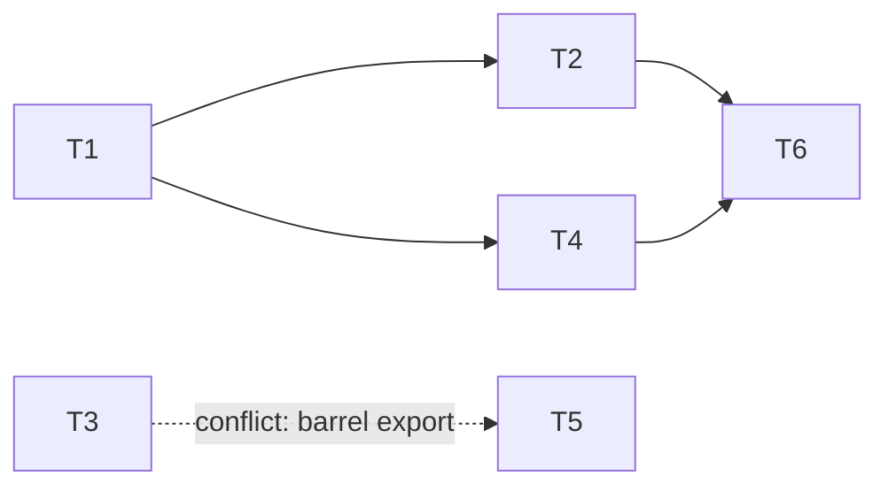

# Cycle Plan: <project / batch name>

> Generated by `parallel-cadence-planner`. Plan-only handoff — implementing agents
> are NOT dispatched by this document. Hand to your orchestration / PM agent.

<!-- Machine-readable metadata: the executor reads these, not the filename. -->
**Slug:** <slug-of-proposed>            <!-- kebab-case; drives cadence/<slug>-* branches -->
**Task-id (source key):** <ABC-1234 | cycle>
**Artifact:** docs/plans/proposed/<YYYYMMDD-HHMM>-<slug-of-proposed>-<task-id>.md
**Source:** <freetext | Linear ABC-XXX | Jira PROJ-XXX | docs/plans/...>
**Generated:** <YYYYMMDD-HHMM>
**Total tasks:** N · **Waves:** W · **Critical path length:** C cycles
**Requirements:** <I> inventoried · <A> assigned · <D> deferred · **0 unaccounted**
<!-- Ledger MUST balance: A + D == I, and 0 unaccounted. Every source requirement is
     in exactly one task's "Requirements covered" or in §6 "Scope boundary". -->

---

## 1. Tasks

| ID | Title | Source ref | Stated deps | Analysis confidence |
|----|-------|------------|-------------|---------------------|
| T1 | …     | ABC-123   | —           | high                |
| T2 | …     | ABC-124   | T1          | high                |
| T3 | …     | freetext   | —           | low (clarify scope) |

## 2. Dependency graph

Legend: solid edge = logical dependency (producer→consumer / declared);
dashed `conflict` edge = no logical order, serialized to avoid a write-write clash.

**Cycles detected:** none. _(If any: list them and recommend merge/split — do not
auto-break.)_

## 3. Wave schedule

Each wave's tasks are safe to implement in parallel. Do not start a wave until every
task in the previous wave has merged green.

### Wave 1 — unblocked, parallel-safe
- **T1** — <title>
- **T3** — <title>
- **T5** — <title>

### Wave 2 — parallel-safe
- **T2** — <title>  _(needs T1)_
- **T4** — <title>  _(needs T1)_

### Wave 3
- **T6** — <title>  _(needs T2, T4)_

**Critical path:** T1 → T2 → T6 → … (C cycles minimum; parallelism cannot beat this).

## 4. Per-task context briefs

> One self-contained brief per task so a fresh agent can start cold.

### T1 — <title>
- **Goal / done:** <acceptance criteria>
- **Requirements covered:** <the atomic requirements this task owns — one line each,
  with source anchor. This is the completeness contract; the touch set below must
  satisfy every line here.>
  - [ ] **T1.1** — <concrete behavior> _(plan.md Phase N §M)_
  - [ ] **T1.2** — <file-less behavior, e.g. "invalidate the reply-reviews query-key
        prefix on success">  _(plan.md Phase N — Inbox freshness)_
  - [ ] **T1.3** — <out-of-block promise, e.g. "counts honor the confidence filter">
        _(Desired End State / design README)_
- **Creates:** <paths>
- **Edits:** <path → region>
- **Reads / depends on:** <paths/modules>
- **Shared surfaces touched:** <migrations / barrel exports / codegen / wiring>
- **Blocks:** T2, T4
- **Notes:** <gotchas, conventions, relevant CLAUDE.md skill to invoke>

_(repeat per task)_

> Every R-id inventoried at ingestion appears in exactly one brief's "Requirements
> covered" above, or in §6 below. The header ledger must show `0 unaccounted`.

## 5. Conflicts & serialization notes

| Pair | Shared surface | Resolution |
|------|----------------|------------|
| T3 ↔ T5 | both append to `pkg/index.ts` barrel | serialize: T3 then T5 |
| T2 ↔ T4 | both add Alembic migration | serialize migration creation; flag rebase-of-down-revision |

## 6. Scope boundary — NOT doing / deferred

> Carried from the source's exclusion list ("What we're NOT doing"), plus anything
> analysis surfaced as deliberately deferred. Every excluded requirement is an
> **owned decision with a reason**, not a silent gap — this is what stops "neither
> planned nor excluded" work from slipping through. These R-ids count as `deferred`
> in the header ledger.

| R-id | Excluded / deferred requirement | Reason | Follow-up ref |
|------|---------------------------------|--------|---------------|
| X.1  | <e.g. Playwright E2E over these flows> | <why — e.g. states not deterministically seedable end-to-end> | <research doc / ticket> |
| X.2  | <e.g. atomic batch-decision endpoint>  | <known trade-off, follow-up> | <ref> |

## 7. Handoff instructions

The executor **flows — it does not gate waves on merges.** Waves here express
dependency *levels*, not stop-and-wait barriers.

1. Dispatch each task as soon as its **base branch exists**, in parallel within a
   wave (isolated worktrees). A stacked task starts the moment its blocker's branch is
   pushed — no waiting for the blocker to merge.
2. **Express dependencies by PR base, not by waiting:** a task with **one** blocker
   stacks its PR on that blocker's branch; a task with **zero or 2+** blockers targets
   the **integration branch** (the convergence point). No task PR targets `main`.
3. As a base advances (blocker gets commits, or merges and its branch is deleted),
   rebase the dependent onto the new base and keep going — flow, don't halt.
4. If a task's real diff diverges from its brief's touch set, re-run this skill to
   recompute the graph — a wider-than-expected touch set can create new conflicts.
5. Low-confidence tasks (§1) should be scoped/clarified before they're dispatched.
